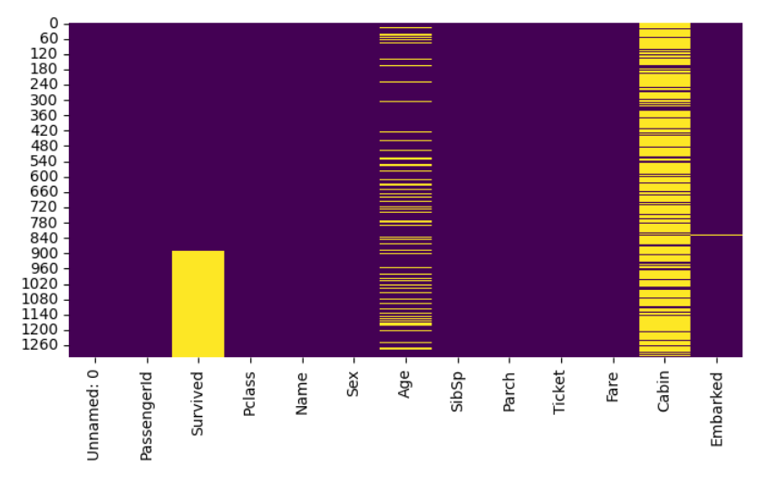

# Titanic Data Analysis and Prediction

## Mục tiêu (Objective)
Bài tập này sử dụng bộ dữ liệu Titanic từ Kaggle để dự đoán liệu hành khách có sống sót sau vụ tai nạn Titanic hay không. Mục tiêu chính là xử lý các giá trị thiếu trong bộ dữ liệu và xây dựng mô hình phân loại để dự đoán kết quả này.

## Ý nghĩa của các cột trong bộ dữ liệu Titanic:

- **PassengerId**: Số thứ tự của từng hành khách.
- **Survived**: Hành khách có sống sót hay không (1 = sống sót, 0 = không sống sót).
- **Pclass**: Hạng vé của hành khách, phản ánh tầng lớp kinh tế-xã hội của hành khách đó (social-economic status).
    - 1: Hạng vé thấp.
    - 2: Hạng vé trung bình.
    - 3: Hạng vé cao cấp.
- **Name**: Tên hành khách (Họ, Tên).
- **Sex**: Giới tính của hành khách.
    - male: nam.
    - female: nữ.
- **Age**: Tuổi của hành khách.
- **SibSp**: Số anh/chị/em hoặc vợ/chồng có trên tàu Titanic.
- **Parch**: Số cha/mẹ hoặc con có trên tàu Titanic.
- **Ticket**: Số vé của hành khách.
- **Fare**: Giá vé của hành khách.
- **Cabin**: Số cabin của hành khách.
- **Embarked**: Điểm lên tàu của hành khách.
    - C = Cherbourg.
    - Q = Queenstown.
    - S = Southampton.

## Các bước thực hiện (Steps Taken)

### 1. **Xử lý dữ liệu thiếu (Missing Data Handling)**:
   - **Phân tích dữ liệu thiếu**: Kiểm tra tỷ lệ dữ liệu thiếu trong các cột và xử lý chúng bằng các phương pháp khác nhau.
   - **Phương pháp xử lý**:
     - **Drop rows with missing data**: Loại bỏ các dòng có giá trị thiếu.
     - **Mean/Median Imputation**: Thay thế giá trị thiếu bằng giá trị trung bình hoặc trung vị.
     - **KNN Imputation và MICE**: Các kỹ thuật nâng cao để thay thế giá trị thiếu dựa trên mối quan hệ giữa các đặc trưng.
   
### 2. **Mô hình học máy (Machine Learning Models)**:
   - **Logistic Regression**: Sử dụng mô hình phân loại để dự đoán tỷ lệ sống sót.

### 3. **Đánh giá mô hình (Model Evaluation)**:
   - Các mô hình được đánh giá bằng các chỉ số **Accuracy**, **F1-Score**, và **RMSE**.

## Xử lý dữ liệu thiếu (Missing Data Handling)

### Phân tích dữ liệu thiếu
- Sau khi kiểm tra dữ liệu thiếu, ta thấy các cột có tỷ lệ thiếu đáng kể, ví dụ như cột **Age** và **Cabin**.

## Tỷ lệ dữ liệu thiếu theo từng cột

Sau khi kiểm tra dữ liệu thiếu, tính toán tỷ lệ phần trăm dữ liệu thiếu của mỗi cột trong bộ dữ liệu Titanic. Dưới đây là bảng hiển thị tỷ lệ phần trăm dữ liệu thiếu của từng cột:

| Cột          | Tỷ lệ dữ liệu thiếu (%) |
|--------------|-------------------------|
| Unnamed: 0   | 0.000000                |
| PassengerId  | 0.000000                |
| Survived     | 31.932773               |
| Pclass       | 0.000000                |
| Name         | 0.000000                |
| Sex          | 0.000000                |
| Age          | 20.091673               |
| SibSp        | 0.000000                |
| Parch        | 0.000000                |
| Ticket       | 0.000000                |
| Fare         | 0.076394                |
| Cabin        | 77.463713               |
| Embarked     | 0.152788                |

### Phân tích:
- **Survived**: Dữ liệu thiếu khá nhiều, khoảng 31.93% giá trị bị thiếu.
- **Age**: Cột này có khoảng 20.09% giá trị thiếu, nên cần phải xử lý để cải thiện mô hình.
- **Cabin**: Cột Cabin có tỷ lệ dữ liệu thiếu rất cao, gần 77.46%. Cần phải cân nhắc loại bỏ cột này hoặc xử lý giá trị thiếu.
- **Embarked và Fare**: Các cột này có tỷ lệ dữ liệu thiếu rất ít, có thể xử lý bằng cách thay thế giá trị thiếu bằng giá trị trung bình hoặc phương pháp đơn giản khác.

### Biểu đồ Heatmap
- 

## Các phương pháp xử lý dữ liệu thiếu và đánh giá mô hình

### 1. **Drop rows with missing data** và áp dụng Logistic Regression

| Metric     | Value              |
|------------|--------------------|
| Accuracy   | 0.7568             |
| F1-Score   | 0.8163             |
| RMSE       | 0.4932             |

### 2. **Mean/Median Imputation** và áp dụng Logistic Regression

| Metric     | Value              |
|------------|--------------------|
| Accuracy   | 0.7672             |
| F1-Score   | 0.4696             |
| RMSE       | 0.4825             |

### 3. **KNN Imputation** và **MICE** và áp dụng Logistic Regression

#### KNN Imputation

| Metric     | Value              |
|------------|--------------------|
| Accuracy   | 0.7672             |
| F1-Score   | 0.4696             |
| RMSE       | 0.4825             |

#### MICE Imputation

| Metric     | Value              |
|------------|--------------------|
| Accuracy   | 0.7748             |
| F1-Score   | 0.4870             |
| RMSE       | 0.4745             |

## Tổng kết

- **Phương pháp tốt nhất**: Dựa trên các kết quả trên, phương pháp **MICE Imputation** có **Accuracy** cao nhất (0.7748) và **F1-Score** tốt nhất (0.4870), cho thấy rằng MICE là phương pháp hiệu quả nhất trong việc xử lý dữ liệu thiếu.
- **Mất mát thông tin khi loại bỏ dữ liệu thiếu**: Phương pháp **Drop rows** làm giảm kích thước của dữ liệu và có **Accuracy** thấp nhất (0.7568), điều này cho thấy việc loại bỏ các dòng dữ liệu thiếu có thể gây mất thông tin quan trọng.

